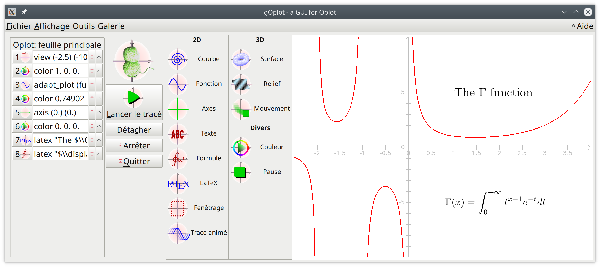

# goplot
Mathematical plotter for the desktop



gOplot is powered by [oplot](https://github.com/sanette/oplot)

## Install

### Dependencies

gOplot needs the venerable libraries SDL1.2 (and not SDL2!) and GTK2
(with GL extension). It also uses the GSL (Gnu Scientific
Library). They are all very common and stable, and should be easy to
install.

On a ubuntu system you may simply type:
```
sudo apt install libgtkgl2.0-1 libgsl23 libsdl-ttf2.0-0 libsdl-image1.2
```

To enable exporting to EPS or PDF you need `fig2dev`:
```
sudo apt install fig2dev
```

Finally for an optimal use, you should also consider installing LaTeX
and `fig2ps`:
```
sudo apt install texlive fig2ps
```

### Binaries

Linux binaries are in the `repo` directory. Just create a new dir (or
use `/usr/local`), extract the archive there, and run `bin/goplot`.

### Source

If you have the usual `ocaml` development stack (`dune`), you can
easily build `goplot` by cloning this repository and
```
dune exec bin/goplot.exe
```
